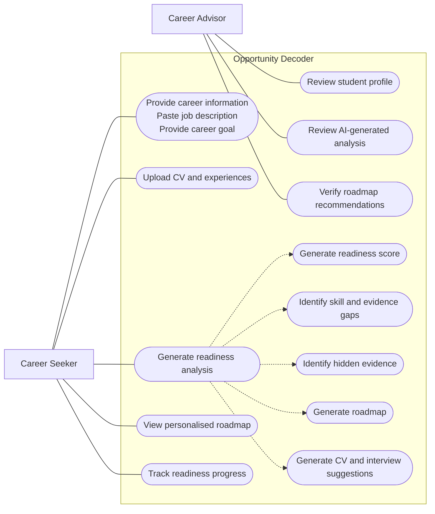

# Opportunity Decoder

Decode the role. Discover your evidence. Apply with confidence.

Opportunity Decoder is a hackathon MVP that helps students understand how close they are to being ready for a specific career opportunity. A student pastes a job description and their CV, skills, projects, volunteering, or other experiences. The app uses Azure OpenAI server-side to create an evidence map, readiness dashboard, and practical roadmap from "where I am now" to "ready to apply".

## Problem statement

Students often self-reject from internships, placements, insight schemes, scholarships, and graduate roles because they do not know how to translate their existing experience into employer language. This is especially true for students with no internship experience, first-generation students, students from underrepresented backgrounds, and students without strong professional networks.

## Solution

Opportunity Decoder analyses a target opportunity against a student's current evidence. It shows what they already have, what hidden evidence they are not communicating well, which gaps are blocking readiness, and which actions will move them fastest towards a credible application.

## Use Case Diagram

The diagram below presents a simplified SysML-style use case view of Opportunity Decoder. It shows the two primary actors, the main system use cases, and the advisor's role in reviewing and verifying the AI-generated roadmap.



## What makes it innovative

This is not just a CV writer or job matcher. The core idea is opportunity access through evidence mapping and readiness roadmapping. The product helps students see that projects, societies, mentoring, coursework, volunteering, part-time work, and hackathons can all become career evidence when framed clearly and honestly.

## 8 Pillars of Engineering Career Development

1. Technical Foundations
2. Professional Experience
3. Portfolio & Proof of Work
4. Soft Skills
5. Industry Exposure & Events
6. Credentials & Continuous Learning
7. Strategic Positioning
8. Application Readiness & Interview Preparation

Each pillar receives a score, status, explanation, evidence found, blocking gap, and next action.

## Azure OpenAI integration

The app calls Azure OpenAI only from the server-side API route at `POST /api/decode`. API keys are read from environment variables and are never exposed to frontend code.

If any Azure OpenAI environment variable is missing, the route returns realistic mock output so the demo still works offline or without credentials.

Endpoint format:

```text
{AZURE_OPENAI_ENDPOINT}/openai/deployments/{AZURE_OPENAI_DEPLOYMENT}/chat/completions?api-version={AZURE_OPENAI_API_VERSION}
```

## How to run locally

Install dependencies:

```bash
npm install
```

Start the development server:

```bash
npm run dev
```

Open:

```text
http://localhost:3000
```

Run checks:

```bash
npm run typecheck
npm run build
```

## Environment variables

Create `.env.local` from `.env.example`:

```bash
cp .env.example .env.local
```

Set:

```text
AZURE_OPENAI_ENDPOINT=
AZURE_OPENAI_API_KEY=
AZURE_OPENAI_DEPLOYMENT=
AZURE_OPENAI_API_VERSION=
```

Do not commit `.env.local` or API keys.

## Demo flow

1. Open the app.
2. Click **Use demo example**.
3. Click **Decode Opportunity**.
4. Show the opportunity summary and overall readiness score.
5. Walk through the 8-pillar dashboard.
6. Open the evidence map and highlight hidden evidence.
7. Tick roadmap items to show the interactive readiness plan.
8. Copy a CV bullet or motivation answer from the application booster.
9. End on the "Should I apply?" recommendation.

## Future improvements

- PDF CV parsing
- LinkedIn import
- University careers service dashboard
- Mentor review mode
- Employer-facing inclusive recruitment insights
- Application tracker
- Personalised learning resources
- Progress saving across multiple opportunities
